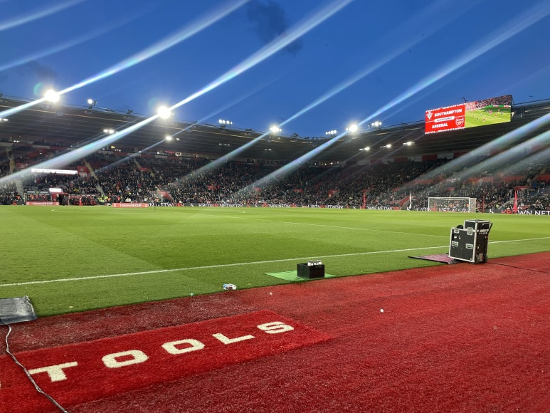
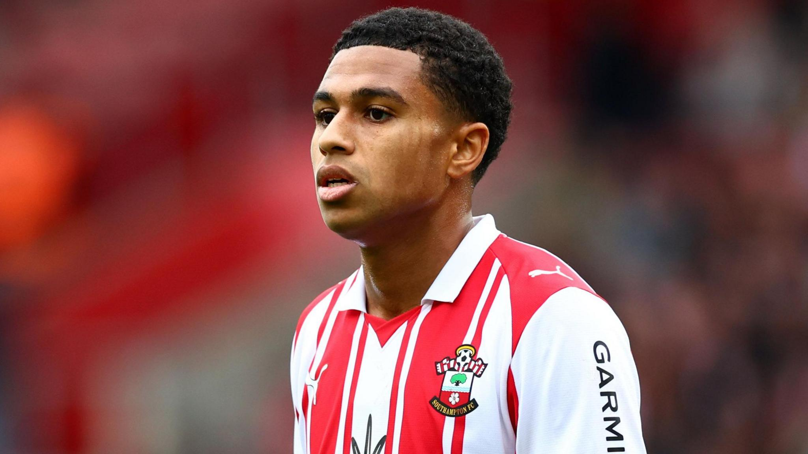

저는 축구를 좋아합니다.
축구와 풋살 중에서는 풋살을 더 좋아합니다.

축구는 11명이 뛰고, 공간이 넓은 만큼 더 정교하고, 다양한 전술이 구현 가능하지만,
아무래도 사람 수가 많은만큼 공 잡는 시간도 적고, 달리다가 허탕 치는 경우가 많은 게 아쉽습니다.

그에 비해 풋살은 한 팀에 5-6명 정도가 뛰고, 그에 따라 공간도 좁아서 더 아기자기하게 풀어나와야 합니다.
사람 수가 적어서 공 잡는 시간도 많고, 달리고 허탕 쳐도 공간이 좁아서 금방 돌아올 수 있습니다.

저는 풋살의 아기자기함을 좋아합니다.
아기자기하게 만들어가려면 팀원들끼리 서로를 잘 알고 있어야 합니다.
어떤 친구는 신중하게 도박 대신 안전한 경로를 택하고,
어떤 친구는 과감하게 공이 잘릴 수도 있는 상황에서도 패스를 넣어주고,
그렇게 서로서로가 어떻게 움직이는지 알게되면서 그 좁은 공간을 물흐르듯 잘 이용할 수 있게 됩니다.

저는 그런 시간이 쌓여서 만든 신뢰나 자연스러운 흐름이 즐거운 것 같습니다.
그게 풋살을 좋아하는 가장 큰 이유 같습니다.

풋살을 하다보면, 그 사람의 결이 느껴집니다.
저는 희한하게도 가끔 풋살을 통해서도 아 이 친구랑 결이 맞는다, 혹은 안 맞는다라는 걸 판단하곤 합니다.
사실 저는 그런 결 맞는 친구들을 한국 대학원에서 운이 좋게도 만나서 팀도 만들었는데,
지금은 제가 따로 영국에 멀리 떨어져와서 그 친구들을 자주 볼 수 없는 게 많이 아쉽습니다.
매일 풋살 후 훌랄라치킨으로 마무리하던 일상이나 매년 나가던 풋살대회가 그립기도 합니다.

생각해보면 제가 어딘가 떠나갈 때마다, 소중한 인연을 두고 와야하는 경우가 생겼었고,
이번에도 어김없었습니다.
저희 할머니 집 주변 초등학교에서 3:3 풋살도 한 나름의 유대감이,
이 관계를 지속시켜주기를 바라겠습니다.

---

저는 지금 사우스햄튼에 있습니다.
사우스햄튼 FC 팬들은 Saints라고 하고, 사우스햄튼 FC 경기장은 St Mary's Stadium입니다.
저도 Saints입니다.
최근에는 사우스햄튼 FC 선수들이 입는 트레이닝 키트도 사서,
입을 때마다 정말 마음에 들어하며 잘 입고 다니고 있습니다.
아쉽게도 사우스햄튼 FC는 지금 2부에 있지만, 리그 막바지인 요즘 다행히 승급 가능성이 다분합니다.

최근 경기는 저희 홈 경기장에서, 아스날과의 FA컵 8강전이 있었습니다.
어떻게 운이 좋게 티켓을 저렴하게 구해서 다녀왔습니다.

아스날 선수들 중에서는 딱히 좋아하는 선수는 없었는데, 라이브로 보니 외데고르가 감동이었습니다.
TV 화면에서는 멀리서 잡아주기에 그 디테일한 움직임이 다 뭉개지는데,
실제로 보니까 터치 하나하나의 템포도 정말 빠르고, 군더더기 없고,
그 사이에 페이크도 계속 섞어주는 게 멋있고 우아했습니다.

사실 이길 줄은 몰랐는데, 어떻게 수비들이 잘 버텨주고, 공격도 기회를 그때그때 잘 살려주어서
결국 승리했습니다.

<figure>
  
  <figcaption>St Mary's Stadium</figcaption>
</figure>

저번 옥스퍼드 전이랑 이번 아스날 경기 모두, 2003년생 24번 Shea Charles 선수가 중요한 골을 넣어서
아마 다음에는 이 친구 유니폼을 사게 되지 않을까 싶습니다.

<figure>
  
  <figcaption>24. Shea Charles [https://www.bbc.co.uk/sport/football/articles/c8jrmmrl38jo]</figcaption>
</figure>

---

전에 응원했던 클럽팀은 바르셀로나, 도르트문트가 있습니다.

바르셀로나는 메시와 세 얼간이 등 라마시아 선수들의 실력이 출중해서 좋아했습니다.
유스에서부터 올라와서 1군, 그리고 트레블까지 하는 모습이 낭만 있어서 좋아했습니다.

도르트문트는 마르코 로이스와 어마무시한 경기장 분위기 때문에 좋아했습니다.
로이스의 실력, 외모, 한 클럽에 오랫동안 충성심, 그리고 팬들의 응원이 낭만 있어서 좋아했습니다.

AS로마 원 클럽맨 프란체스코 토티, 레스터 시티의 동화 우승, 아스날 무패 우승과 같은
낭만적인 이야기들이 저를 자꾸 축구에 끌어들이는 것 같기도 합니다.

---

이곳 영국, 학교에서도 풋살은 꾸준히 하고 있습니다.
풋살 Team에 뽑혀서, 2군으로 매주 훈련도 하고 있습니다.

처음에는 서로를 부르거나, 패스를 달라고 하거나 하는 것들이 용어가 꽤 많이 달라서,
갈 때마다 긴장도 하고 괜히 주눅들고 그랬었습니다.

그래도 지금은 친구들도 편해지고, 영어도 조금씩 트이고, 장난도 슬슬 치면서,
이제는 편하고 즐거운 마음 뿐입니다.

언어의 장벽이 허물어졌다가, 다시 굳건해지고, 또 허물어지기를 반복하는 중입니다.