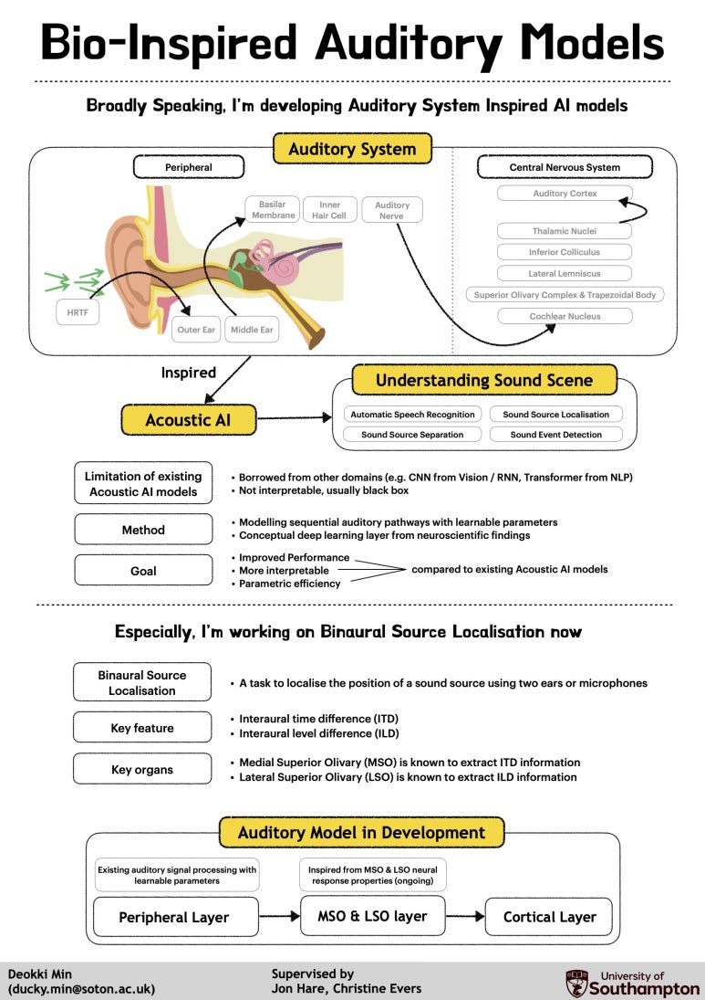

저는 현재 사우스햄튼 대학교 박사과정 반년차입니다.
제 박사과정 프로젝트 이름은 'Bio-inspired Auditory Models' 입니다.

사람은 소리의 종류를 감지할 수 있습니다.
사람은 소리의 위치를 감지할 수 있습니다.
사람은 아주 시끄러운 상황에서도 자기가 듣고싶은 작은 소리에 집중하여 주의를 기울일 수 있습니다.

그 과정이 저희에게는 아주 자연스럽고 쉽고 일상적인 일이지만,
이것을 인공적인 무언가 (AI) 가 할 수 있도록 하는 것은 무척이나 복잡하고 어려운 일입니다.

제가 하는 연구는 AI를, 소리에 있어서 최고의 성능을 자랑하는 사람과, 더 닮게 만드는 연구입니다.

청각계 (Auditory System) 는 크게 두 부분으로
(1) 귀부터 시작해서 외이, 중이, 달팽이관까지의 주변부와
(2) 뇌 속의 중추신경계로 구성되는데
저는 이 청각계의 각 단계를 AI 속에 모방하는 작업을 하고 있습니다.

즉,
1. 소리를 이해하는 청각계 (Auditory system / Bio) 에서
2. 영감을 받아 (Inspired)
3. AI 모델 (AI models / Auditory Models) 을 구축하는 연구입니다.
그래서 제 연구 프로젝트가 'Bio-inspired Auditory Models' 입니다.

이를 통해, AI가 더 효율적/효과적으로 소리를 이해하도록 하는 것이 연구목적입니다.
지금은 소리의 위치를 감지하게 하는 것에 집중하고 있습니다.

---

<figure>
  
  <figcaption>연구주제 설명 포스터</figcaption>
</figure>

---

사실 청각계는 완전히 규명되지 않았습니다.
즉 인류는 사람이 어떻게 그 복잡한 과정을 실시간으로 수행하는지 정확히 모릅니다.

그래서 그 청각계 및 뇌 속의 복잡한 과정을 알아내보기 위한 수많은 청각신경과학 논문들이 있고,
저는 그 신경과학 논문들을 읽고 아이디어를 쌓고,
AI에 적용해보는 작업을 합니다.

사실 이 박사과정 연구주제는 제 석사과정의 확장판입니다.

석사과정에서는 청각계의 조그마한 부분 (청각피질) 에서 영감을 받아 AI 모델을 만드는 연구를 했습니다.
(석사 졸업논문 : Auditory cortex neural response-inspired sound event detection)
그리고 현재는 청각계의 더 큰 범주 혹은 전체를 다루려는 시도를 하고 있습니다.

---

어떻게 보면 모든 직업에 연구가 필요합니다.

요리사는 레시피를 연구하고,
목수는 가구 혹은 건물의 심미성과 튼튼함을 연구하고,
가수는 창법을 연구하고,
정비사는 본인의 수리기술이나 기계의 구조를 연구하고,
선생님은 아이들을 올바르게 인도하는 법을 연구합니다.

저는 연구자라는 직업을 아마 가지게 될 것 같습니다.
이 직업은 이름부터가, 아마 다른 직업보다 연구를 좀 더 본격적으로 하는 직업인가 봅니다.

사실 연구라는 게 별거 없습니다.
공부하고, 시도해보고, 실패하고, 다시 공부하고, 시도해보고.
사실 어쩌면 거의 매일 실패만 하고 있기에, 실패 전문가라고 불러도 됩니다.

그래도 아마 대부분의 연구를 하는 분들은, 그 실패를 나름의 방식으로 즐거워한다고 생각합니다.
저도 지금 걷는 이 길이 매일매일 나름 즐거운 것 같습니다.

또 하나 다행인 건, 실패해도 크게 뭐라하는 사람이 없다는 점입니다.
실패하면 다시하면 됩니다.

---

제가 궁극적으로 하고싶은 것은,
소리를 이해하는 과정을 이해하는 것입니다.
이해의 이해.

개인적으로는, 그게 그냥 궁금해서 이해하고 싶습니다.

사회적으로는,
그 이해를 바탕으로 청력이 손상되거나 잃은 사람들을 보다 높은 수준으로 진단할 수 있을 것이고,
보다 높은 수준으로 청력을 복원하거나 치료할 수 있을 거라고 생각합니다.

그렇게 되면,
청력을 잃은 사람들이 가족이나 친구, 사회로부터 멀어지고 고립되는 걸 완화할 수 있지 않을까 싶습니다.
제 기억에 저희 할아버지께서는 청력이 떨어지시면서 조금씩 고립되셨던 것 같습니다.
저는 그 과정을 조금은 무기력하게 지켜봤던 것 같습니다.