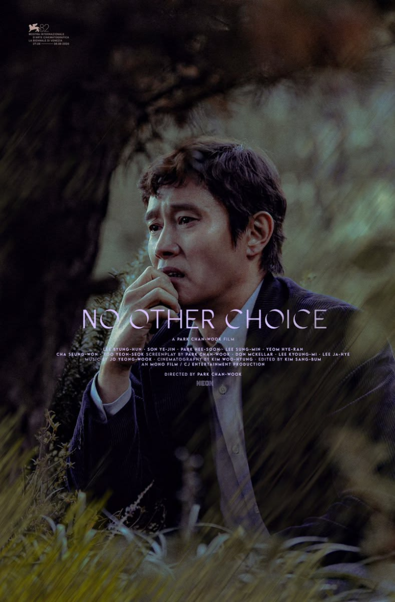
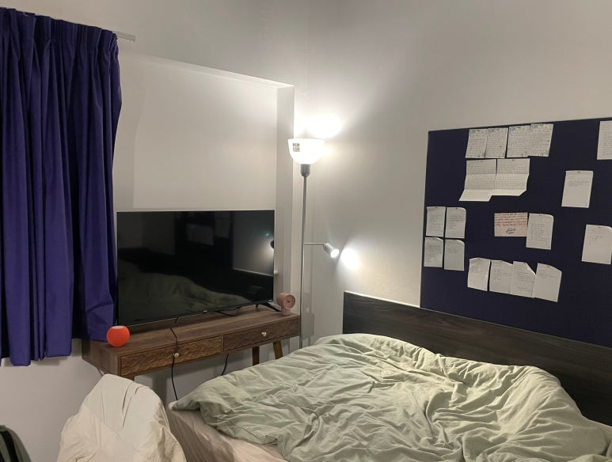

올해는 벌써 23편의 영화를 봤습니다.

혼자서 본 영화에 대해 별점도 매기고, 이동진 평론가를 따라서 한줄평도 남깁니다.
제 영화에 대한 기준은 아래와 같습니다.

---

첫째, 우선 재미가 있는가.

소설과 마찬가지로 영화도 우선 재미가 있어야 합니다.
재미 없는 의미라는 게 있는지 궁금합니다.

재미가 없다는 건 마음에 와닿는 게 딱히 없다는 것이고,
마음에 와닿는 게 없는데 의미가 있기는 어려운 것 같습니다.

다행히도 저는 대부분의 영화를 재미있다고 느끼는 것 같습니다.
지금 생각나는 재미없다고 느낀 영화에는,
감독이 본인의 뜻을 마음껏 펼치지 못해서
이상스레 망가진 듯한 최근 한국영화들이 있습니다.

---

둘째, 층이 다양한가.

층이라고 하면, 세상을 이해하는 하나의 관점이라고 볼 수 있습니다.
층이 다양하다는 것은, 세상을 하나의 관점으로만 보지 않고 다양한 관점에서 본다는 것입니다.

그 영화가 단순한 하나의 관점으로만 그려진다면 아무래도 근사하진 않을 겁니다.
그래서 뻔한 멜로영화, 뻔한 액션영화, 뻔한 청춘영화.
이런 말들이 생겨나는 듯합니다.

영화는 결국 감독이 세상을 어떻게 바라보는가가 투영됩니다.

대체로 명장이라고 하는 감독들의 영화를 보면 그 층이 다양합니다.
그래서 명장들의 영화는 믿고 보게됩니다.
이미 그 감독이 세상을 바라보는 시선폭이 넓다는 것을 확인했기에,
그 다음 영화도 자연스레 층이 다양한 영화가 나오게되는 순리인 것 같습니다.

그 층이 너무 다양해서 압도되고 심지어는 이해하기도 힘들었던 영화는,
다니엘스 감독의 <에브리싱 에브리웨어 올 앳 원스>가 있습니다.
태초부터 알고 있던 듯한 알쏭달쏭한 것들이 표현되어 있는 영화라고 느꼈습니다.

<figure>
  
  <figcaption>&lt;Everything Everywhere All at Once&gt; 
[https://i.pinimg.com/736x/36/bf/bc/36bfbca79538b35e9972e4f9f0020ac2.jpg]</figcaption>
</figure>

---

셋째, 연출의 질이 높은가.

연출이라고 하면,
제가 생각하기엔 촬영기법과 음악이 있는데 이 둘 또한 명장을 믿고보게 하는 요소인 듯합니다.
명장들의 촬영기법과 음악은 대체로 질이 높다는 것을 늘 실감합니다.

이건 참 인상적인 촬영기법이었다라고 생각나는 것은 박찬욱 감독의 <어쩔 수가 없다>에서, 
가을 낙엽길을 따라 이병헌이 도망쳐 내려오고, 저 멀리서 염혜란 배우가 미친듯이 쫓아오는 장면이 생각납니다.

음악도 같은 영화에서 조용필의 <고추잠자리>가 삽입된 부분도 왠지 모르게 인상적이었습니다.

두 장면을 다시 생각해보니 참 어떻게 보면 아이러니하다는 느낌을 잘 표현한 것 같습니다.
아름다운 가을 낙엽길과 필사적인 추격.
살인과 엄마를 찾는 내용의 음악.
심지어는 제 이탈리아 친구가 그 노래 좋다고 칭찬한 걸 보면, 
그 인상적인 느낌이 한국인이 아닌 사람에게도 전달이 되는가 봅니다.

<figure>
  
  <figcaption>&lt;어쩔 수가 없다&gt; 
[https://i.pinimg.com/1200x/e2/41/04/e24104e380084d8847474bdb45f580c0.jpg]</figcaption>
</figure>

---

지금 제 방은 작은 영화관입니다.
그 점이 제가 이 방을 더 좋아하게 만드는 것 같습니다.
내가 속한 공간을 정말로 좋아해본 적이 있냐고 스스로에게 묻는다면,
사실 저는 지금이 처음인 듯 합니다.

타지의 그리 넓지는 않은 공간이지만, 참 마음에 드는 공간입니다.
이 공간에서 저는 세상을 이해하는 관점을 조금씩이나마 넓혀가고 있습니다.

<figure>
  
  <figcaption>나의 방 겸 작은 영화관</figcaption>
</figure>