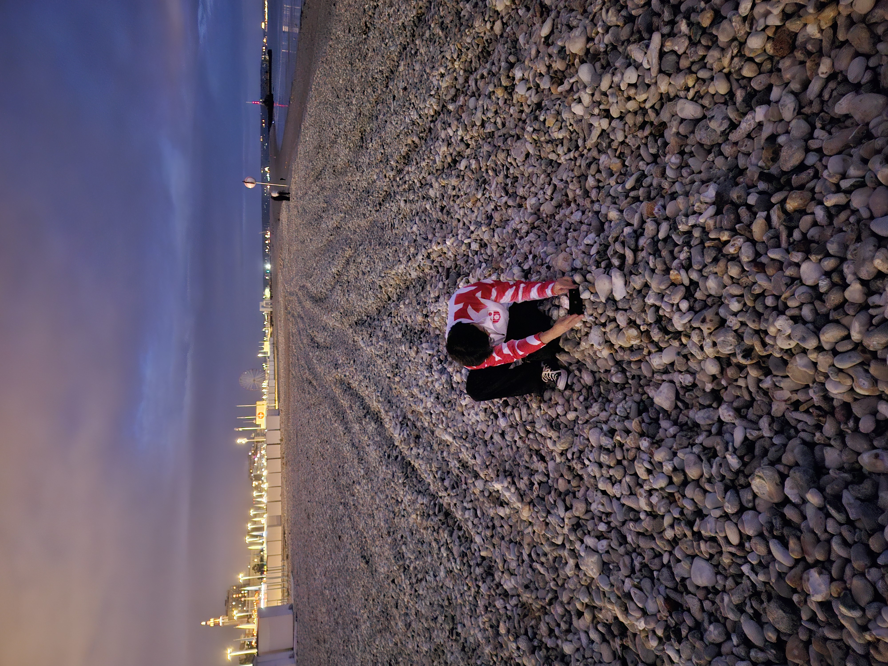

자유로움은 어디에서 오는가.
제가 부여받은 큰 자유는 절대 자유롭다는 느낌과 비례하지 않습니다.

저는 큰 자유를 부여 받았습니다.
계급이 없고, 부양할 가족이 없으며, 외국에 혼자 있고, 정해진 출퇴근 시간이 없고, 아무도 간섭하지 않습니다.
그럼에도 제가 그 큰 자유만큼 자유로움을 느끼지 못하는 이유는 무얼까요.

---

생각해보면 제 자유로움이 가장 크게 방해되는 때는,
제 생활이 불만족스럽다고 느낄 때이고,
그런 때는 대개 일이든 휴식이든 몰입의 질이 떨어질 때입니다.

저는 제가 하는 일을 좋아하고,
또 그 일을 더 잘 하기 위해서,
또 제 삶을 더 잘 살아가기 위해서 휴식이 꼭 필요합니다.

일, 그리고, 휴식.

일의 성취 여부는 크게 상관이 없습니다.
실패는 괜찮습니다.
충분히 몰입하고 난 뒤의 실패는 정말로 성공의 어머니가 됩니다.

하지만 몰입이 적은 날은 그저 아쉽습니다.
엉덩이만 붙이고 앉아서 의미없이 시간을 죽이고 효율은 극악으로 떨어집니다.
그런 날에는 휴식 시간을 떼서 일을 하는 시간을 늘리고,
그로 인해 일과 휴식의 경계가 모호해지고,
그 속에서의 몰입은 더 옅어지고,
그렇게 악순환이 시작됩니다.

---

어떻게 몰입을 유지할 수 있을까요.

우선 일과 휴식의 경계를 확실히 해야합니다.
스스로 출근과 퇴근 시간을 정합니다.
간단합니다.
일과 시간에는 일에 몰입하고, 그 나머지 휴식 시간에는 휴식에 몰입합니다.

하지만 몰입이 계속 반복되다 보면 권태가 찾아오고,
이런 때에는 시간과 공간에 변화가 필요할 때입니다.
그러면 드디어 부여받은 큰 시공간적 자유를 발휘하는 때입니다.

시간을 바꾸어서, 일과 시간은 줄이고 휴식 시간을 늘려 시간의 자유를 체감합니다.
공간을 바꾸어서, 그 신선함이나 새로움으로 공간의 자유를 체감합니다.

휴식 시간에도 삶을 꾸려나가기 위해서 해야 할 일이 있습니다.
청소, 요리, 보살피기, 행정 잡무 등 시간을 들여야할 때가 있습니다.
저는 보통 이러한 해야하는 것들을 미루고, 
건강하지 못한 방식으로 휴식을 취할 때에, 의무감이 들어섭니다.

휴식에서 의무감에 의해 죽어나가는 시간들을 되살려야합니다.
오히려 휴식 시간에서 죽은 시간이 더 쉽게 만들어집니다.
그 시간을 즐기지 못한 채, 의무감에 휴식이 병들어가는 죽은 시간.

휴식은 정말로 회복할 수 있도록 건강히.

해야하는 일상의 일들은 신속하고 효율적으로 마무리해놓고,
나머지는 편하게 쉬고 즐기면 됩니다.

---

<figure>
  
  <figcaption>르아브르의 해변에서 자유로움. 돌에 카메라를 세우려는 몰입. </figcaption>
</figure>

자유에 대한 글이지만, 어떻게 하다 보니 몰입에 대해서 더 많이 적었습니다.
몰입의 무아지경이 인간이 느끼는 자유인지도 모르겠습니다.